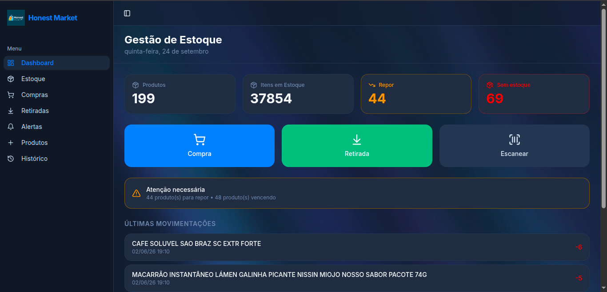
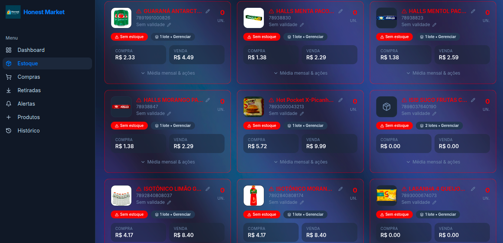
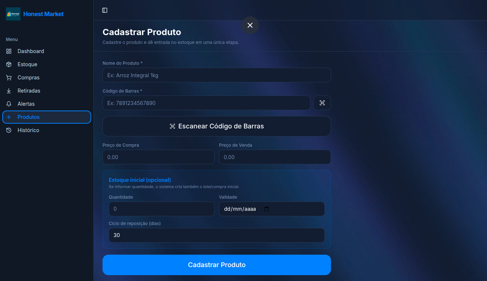

# Honest Market

Sistema web de gestão de estoque para acompanhar produtos, lotes, validade e movimentações em um só lugar. Desenvolvi o projeto para transformar tarefas de cadastro, compra e retirada em um fluxo simples, com alertas que ajudam a identificar itens para reposição e próximos do vencimento.

## Visão do projeto

O catálogo de produtos é separado dos lotes e das movimentações. Uma compra registra a entrada de itens; uma retirada ou ajuste atualiza o estoque e mantém o histórico. O painel reúne os principais números e oferece atalhos para as tarefas mais frequentes.

### Telas

| Painel | Estoque | Cadastro |
| --- | --- | --- |
|  |  |  |

## Funcionalidades

- Cadastro e edição de produtos com código de barras, imagem e preços.
- Controle de quantidade por lote e data de validade.
- Registro de compras, retiradas e ajustes, com histórico de movimentações.
- Leitura de código de barras pela câmera.
- Consulta de produtos por código de barras, com possibilidade de preenchimento a partir de fontes externas e cadastro manual.
- Alertas de estoque baixo, falta de produtos e proximidade do vencimento.
- Painel com indicadores e ações rápidas.

## Tecnologias

React 18, TypeScript, Vite, React Router, TanStack Query, Tailwind CSS, shadcn/ui, Supabase (PostgreSQL e Edge Functions) e html5-qrcode.

## Como executar localmente

**Pré-requisitos:** Node.js, npm e um projeto Supabase configurado para esta aplicação.

```bash
git clone https://github.com/brunoyves53-prog/estoquemercado.git
cd estoquemercado
npm install
cp .env.example .env.local
npm run dev
```

Preencha `.env.local` com o URL, o identificador do projeto e a chave publicável do **seu** projeto Supabase. O modelo das variáveis está em [`.env.example`](.env.example). Para usar as tabelas, aplique as migrações em [`supabase/migrations`](supabase/migrations) ao seu projeto. A consulta opcional à API Cosmos usa a Edge Function `cosmos-lookup` e exige o segredo `COSMOS_API_TOKEN` configurado no ambiente da função. Não coloque chaves privadas em variáveis `VITE_`.

Scripts disponíveis: `npm run dev`, `npm run build`, `npm run lint` e `npm run test`.

## Acesso à aplicação

A instância com dados reais não oferece acesso público para edição. As imagens acima mostram o funcionamento sem expor os dados da aplicação. Para avaliar o código, consulte as páginas em [`src/pages`](src/pages), a integração em [`src/integrations/supabase`](src/integrations/supabase) e as migrações do banco.

## Autor

[Bruno Yves Monteiro de Paula](https://www.linkedin.com/in/bruno-yves-monteiro-de-paula-923aa93b4/)
